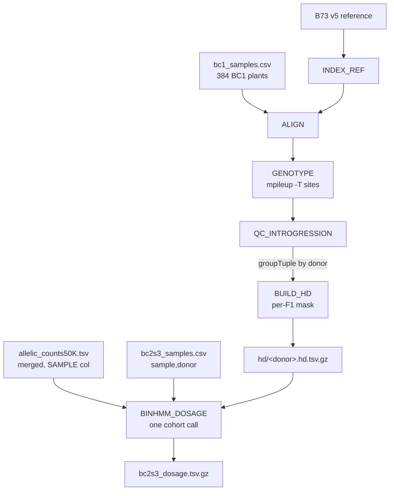

# nilhmm — Phase 1 (Nextflow, modular)

**The point:** the pipeline has two halves.
1. **Build the mask** — turn the BC1 individuals into a **per-F1 mask of informative sites** (the sites where a BC1 plant is het).
2. **Call dosage** — apply that mask to the **already-existing** merged BC2S3 counts (drop the sites not informative for each line's F1), then run binHMM. BC2S3 is already aligned and counted (`rsstu .../BZea/bzeaseq`) — half 2 does **not** map or count.

## Pipeline overview



The live DAG comes from `sbatch q_nilhmm_dryrun.sh` (a `-preview -with-dag` dry run — no tasks run).

## Layout (nilhifi structure: main.nf wires, resources live in each module)
```
main.nf                 wiring only (imports + workflow)
nextflow.config         profiles (slurm/local), conda env per label, reports
modules/
  index_ref.nf          INDEX_REF (8/64GB/2h)  — minibwa index + faidx (once, gates ALIGN)
  align.nf              ALIGN   (8/24GB/6h)   — BC1 plants
  genotype.nf           GENOTYPE(4/16GB/4h)   — bcftools mpileup -T sites (BC1)
  qc_introgression.nf   QC_INTROGRESSION (2/16/2h) — contamination flags per BC1 plant
  build_hd.nf           BUILD_HD (2/16/4h)    — per-F1 mask (union het within teosinte blocks)
  binhmm_dosage.nf      BINHMM_DOSAGE (4/32GB/8h) — apply masks to the merged counts -> binHMM (one cohort call)
bin/                    qc_introgression.R (STUB)  build_hd.R  binhmm_dosage.R
q_nilhmm_pipeline.sh    head sbatch
```

## Flow
```
1. build the mask
   bc1_samples.csv -> ALIGN -> GENOTYPE (mpileup -T sites) -> QC_INTROGRESSION
       -> groupTuple(by donor) -> BUILD_HD -> hd/<donor>.hd.tsv.gz   (the per-F1 mask)

2. call dosage (one binhmm run over the whole cohort)
   allelic_counts50K.tsv (merged, SAMPLE col) ┐
   bc2s3_samples.csv (sample,donor)           ├─> BINHMM_DOSAGE -> bc2s3_dosage.tsv.gz
   every <donor>.hd.tsv.gz mask ──────────────┘   (keeps only each line's F1 informative sites)
```
The dosage script reads the merged counts **once** and keeps each line to its F1's mask sites; binhmm dispatches per sample on the `name` column internally (no per-sample splitting, no fan-out).

## Inputs (`nextflow.config`)
- `bc1_samplesheet` — `sample,donor,taxon,fastq_1,fastq_2` (384; donor = `accession_P<P1>`)
- `bc2s3_counts`    — the **merged** `allelic_counts50K.tsv` (header `SAMPLE CONTIG POSITION REF_COUNT ALT_COUNT ...`)
- `bc2s3_samples`   — `sample,donor` map (selects which lines to call)
- `reference` (B73 v5; INDEX_REF builds minibwa index + faidx) + `sites` (bzeaseq biallelic, bgzip+tabix) — mask half only

## Run
```bash
sbatch q_nilhmm_pipeline.sh          # head job submits every process to Slurm
```

## Results (`params.outdir` = `ZEAL/results`)
```
ALIGN/<sample>/  genotype/<sample>/  qc/<sample>.qc.tsv   (BC1)
hd/<donor>.hd.tsv.gz                 the per-F1 mask
bc2s3_dosage/bc2s3_dosage.tsv.gz     dosage calls (existing counts, masked; keyed by sample)
pipeline_info/                       timeline / report / trace
```

## Conda envs
Two envs: `envs/assembly.yml` (minibwa, samtools, bcftools, htslib) for `align`/`call` — Nextflow builds it from the yml — and a **prebuilt** R env for `rstats` (`nilhmm.yml` + `install_github` the nilhmm package, which can't be expressed in a yml). The rebuilt tool env is cached on the persistent partition:
```bash
export NXF_CONDA_CACHEDIR=$ZEAL/envs   # set in the head job (survives /share wipes)
```
To use a prebuilt env, point a `withLabel` at its prefix (see the comment in `nextflow.config`).

## TODO
- implement `bin/qc_introgression.R` (still a stub)
- ensure the reference dir on `/rsstu` is writable (INDEX_REF writes .l2b/.mbw/.fai next to it)
